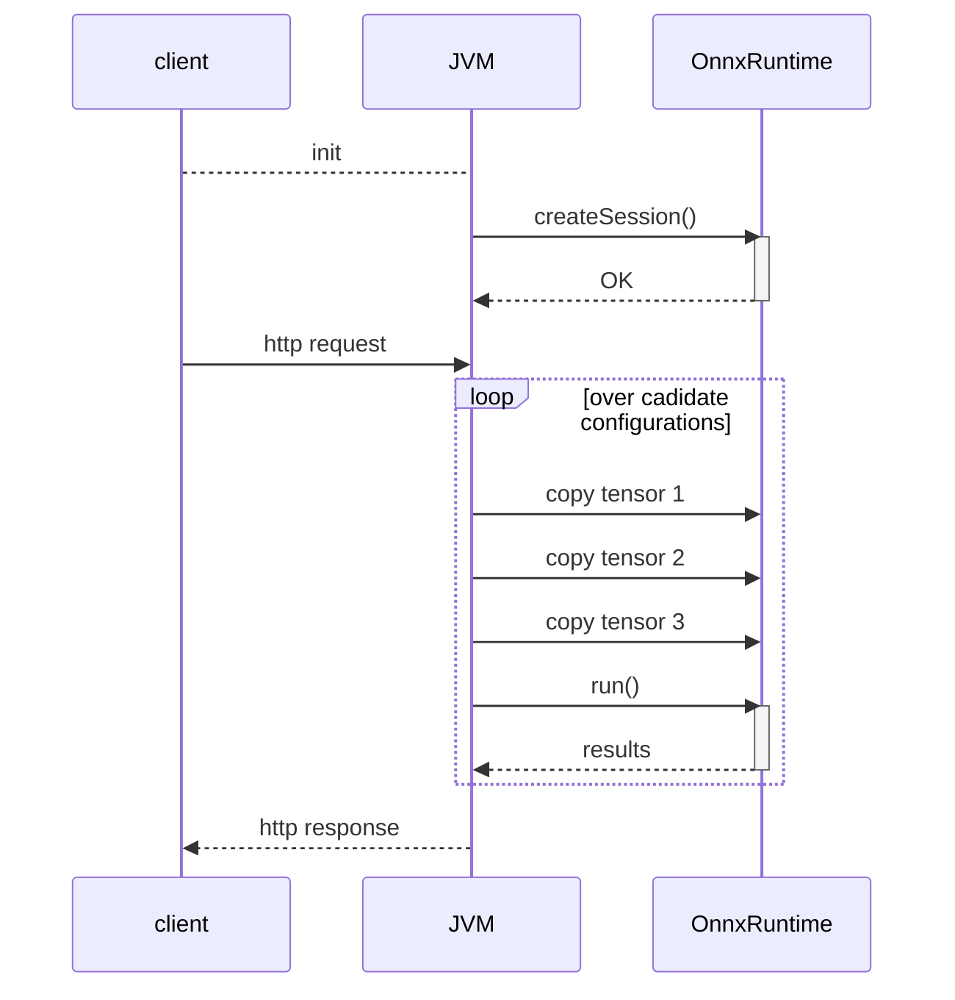

_This article was published as a part of CARTA ZERO's Advent Calendar 2024 event. [Link](https://techblog.cartaholdings.co.jp/entry/onxx-small-model-improve-performance)_

I recently worked on migrating a production real-time bidding (RTB) service to the ONNX runtime framework. 
RTB is a machine learning inference service that relies primarily on small but carefully designed estimators, such as logistic regression and pre-trained lookup tables. 
Most of these can be serialized to under 100KB, and some are even as small as 5KB.

These models are 'small' compared to popular deep neural networks (which have megabytes of embedding data), and especially compared to even modest large language models (LLMs). 
This makes them relatively easy to efficiently implement in native code (Kotlin) without the need for the overhead of additional frameworks. 
In fact, I doubt that the ONNX runtime (a C++ library) can match the latency of the existing native implementation solely because of all the overhead.

There are, however, some good reasons to try it anyway. Here are the main ones:

#### Good reason 1: less code duplication / less bugs

At present, we maintain a custom regression inference code (including unit tests) in production. 
There is also duplication between the training (Python) and serving (Kotlin) implementations, especially for data preprocessing. 
This is both cumbersome to maintain and test, and it occasionally causes difficult-to-detect bugs when implementations diverge.

With ONNX, we should be able to eliminate most of the custom code and share inference and preprocessing logic between environments.

#### Good reason 2: beyond linear models / faster experimentation

Logistic regression works great, but it is not the only architecture worth experimenting with.
Right now, attempting anything more complex requires serious changes and refactoring: 
 - rewriting most of the native implementation (both inference and training)
 - adding multiple new framework dependencies (and managing them from now on) 

With ONNX, we ideally can get to a point where swapping a machine learning models is done with ZERO production code changes.

#### Good reason 3: future proofing

Putting ONNX as an abstraction layer between inference and training will hopefully remove most of the coupling between them. 
Potentially, we could switch the inference service away from Kotlin (even if only part of it) and still use the exact ONNX artifacts from the current production.

In the same vein, replacing some of the simplest algorithms (such as lookup tables) with ONNX models 
can be treated as providing placeholders for when a better solution is ready to be deployed.

#### Wrong reason 1: improved inference performance

High performance is unfortunately difficult to guarantee, and ONNX is not a magic solution either. 
In the case of simple natively implemented regression models, there really is not much hope for ONNX to be faster.

#### Wrong reason 2: easy access to GPU inference 

It is definitely nice to access GPU inference with only a few lines of code, but we do not really have a use-case yet. 
CPU computation is rarely a bottleneck, especially compared to feature store access (from external storage).

## The first (failed) attempt

For the initial proof of concept, there are only a few steps needed to migrate to ONNX:

1. Wrap the existing model training code in an `sklearn.Pipeline`, ideally including preprocessing.
2. Convert the `sklearn.Pipeline` object to ONNX with the `skl2onnx` library. Push new artifacts to S3/GCS.
3. Add the latest `onnxruntime` dependency to the inference project (keep an eye on Linux compatibility issues).
4. Replace the existing custom inference implementation with a few lines of standard `onnxruntime` code 
5. Deploy and wait for profit!

From implementation to production, this all could be achieved in a week or two.
In fact, I have spent significantly more time refactoring existing code than adding ONNX integration.

While the implementation is easy, the deployment results can be disheartening.
Even with a single logistic regression replaced, our service latency increased by a whopping +10ms.
And that's without providing any business improvements.

## Performance optimization

Let's look carefully at possible performance bottlenecks. 

While our baseline implementation was written natively in Kotlin (JVM), the ONNX Runtime framework is implemented in C/C++.
I presume that this causes the JVM to make a lot of JNI calls.
Individual calls are probably not much to worry about.
However, if repeated in an unnecessary loop, these can add up.

I have provided an oversimplified sequence graph to visualize these calls.

Major takeaways from the above:  

* `createSession()` takes care of loading the ONNX data into memory and initializing the internal configuration. This is a heavy operation that only has to be performed once in a service's lifetime.
* The `for` loop iterates over every candidate configuration and then makes one inference call per configuration. This is clearly wasteful, especially if ONNX runtime calls come with additional JNI overhead. 
* Copying data to the ONNX runtime seems to take a non-negligible amount of time. There is no equivalent overhead in the native code, however.  
* `run()` executes the ONNX model, so the simpler and smaller the model is, the faster this call should end.

There is something to optimize at each of these steps.

#### Improvement #1: Vectorization
The `for` loop seems to be the major bottleneck for executing non-native code.

A vectorized implementation is significantly more performant (mostly due to reducing unnecessary JNI calls).
Fully refactoring the existing codebase was not straightforward, but it seems to be worthwhile.
From early estimates, I am expecting 2.9x faster execution times.  

#### Improvement #2: Carefully Optimized ONNX Graph
After some more debugging of the .onnx file, it turned out that `skl2onnx` produces a suboptimal solution.
Specifically, instead of translating sklearn `OneHotEncoders` into ONNX equivalent operations and then feeding very sparse vectors to `LinearRegression`, it is much more performant to use `LabelEncoder` with a `Sum` operator instead. 

After additional trimming of all zero coefficients, the custom-made .onnx files were 3.6x faster (on top of the vectorization improvements).

#### Improvement #3: Improved Inputs Layout (unsuccessful)
On the other hand, I could not find a good way to improve the tensor copy code, at least not yet.

I am loading every vectorized feature as a separate ONNX input, which conveniently allows matching necessary features with ONNX inputs at runtime, without the need for additional mapping information.
It feels like packing all these into a single higher-dimensional input tensor should provide performance benefits (fewer JNI calls), but local tests did not confirm this. 

### Final Result
Offline performance tests showed a more than 10x improvement with all optimizations enabled. 

I am expecting only a 1-2ms overhead in the staging/production deployment.

## Tips for working with ONNX

Lesson learned 

1. Prepare an offline testing environment that can measure both performance and result correctness
   * It is easy to introduce trivial performance bugs (like slow hashing) and even easier to break some untested/undocumented function during refactoring.
   * The JVM aggressively optimizes executed code, so be especially wary about the very first executions. 
   * When offline results look good, confirm the best implementation in a staging/production online experiment.
2. Never run inference inside a native loop; when possible, vectorize feature data.
3. Heavily regularized models can be full of zero coefficients. For simple models like logistic regression, trimming may make the inference faster.
4. Sometimes rewriting the ONNX graph directly using carefully selected operators may be worth the effort.
5. Consider carefully how to copy data; if possible, cache or group tensors.  

Extra tips

* Get to know the ONNX protobuf schema and opset documentation well (https://github.com/onnx/onnx/blob/main/docs/Operators.md)
* `float32` operations cause tiny numerical errors that make exact model comparison slightly annoying. Probably no need to worry about it, though.
* Even in the JVM, ONNX runtime can cause memory leaks, so be sure to close()/use() all the tensors.
* IR compatibility is not the same as opset compatibility. While I don't recommend it, you can easily run newly created .onnx files on older `onnxruntime` version.
* Simple/dummy ONNX models are easy to create and can be used as reference points for benchmarking.    
* Dictionaries of data (lookup tables) can be easily represented with the ONNX `LabelEncoder` operator. Just remember that there are no float64 outputs.
* I have experienced some unusual performance behavior when testing long input tensors (dim=10000). It is probably important to set testing runs with representative parameters (like typical tensor lengths).  
