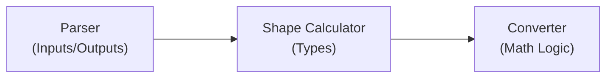

_This article was published as a part of CARTA ZERO's Advent Calendar 2025 event. [Link](https://techblog.cartaholdings.co.jp/entry/custom-preprocessing-design-for-onnxruntime)_


Our team operates a large real-time bidding system for online advertising. We deploy a selection of fast machine learning models against an enormous volume of bid requests.

Recently, I have been working on the modernisation of our ML pipelines, specifically focusing on the shared preprocessing implementation.
I think this is a great opportunity to share some insights on our blog.

Before diving into the nitty-gritty details, let’s start by introducing a rough overview of the overall architecture, and then explain why we care about preprocessing at all. In the final sections, I will show more concrete examples of encoder customisation.

By the end of this post, you'll see how we eliminate training-inference drift by serializing everything—from raw strings to final predictions—into a single ONNX artifact.


## The overview of our machine learning pipeline architecture 

The goal of our MLOps pipeline is to train and deploy machine learning models repeatedly, and without significant developer interaction.
There are many components that come together to provide a good experience, including pipeline orchestration, data collection, and so on.
The overall objectives are very simple:

- Train a machine learning model
- Package it into ONNX format
- Deploy it to production as-is

To achieve this, we follow these concrete steps:

- Machine learning models are always wrapped in sklearn pipelines
- A single pipeline is composed of three sections:
	- Pre-processing (OneHotEncoding, SimpleImputer, etc.)
	- Model training (with sklearn, PyTorch, LightGBM, etc.)
	- Post-processing (calibration, CDF, etc.)
- To make training work, we need custom code to represent ML frameworks as sklearn classifiers
- The trained pipeline is exported to ONNX using the skl2onnx conversion library
	- Which handles most standard sklearn components (with notable exceptions)
	- Requires lightweight callbacks to export PyTorch modules (etc.)
	- And quite a lot of custom code to handle all the fun preprocessing
- We write a whole bunch of unit tests to guarantee that custom code produces the same results for sklearn and ONNX
- Finally, a full end-to-end test runs automatically to verify the same behavior in production code


## What’s the preprocessing pipeline and why does it matter

Pre-processing is a part of the overall pipeline that takes a set of raw features (from the data store) and transforms them into direct tensor inputs for machine learning models. Typically, this involves simple boilerplate operations that often go unmentioned in smaller projects, yet form an important foundation of a machine learning pipeline. One crucial aspect here is that this transformation is implemented exactly the same during training (Python) as during inference (Kotlin in our case).

We can think of pre-processing in two ways, depending on the context and requirements:
- Faithful transformations (aka encoding), which take raw data and encode it into regular numbers
- Creative transformations (aka feature engineering), which extract specific information from raw data

Let’s look at some trivial examples:

- `ad_campaign_id` is an integer that represents a nominal feature: each value represents a distinct object, and it makes no sense to compare or algebraically transform such IDs. These integers can be used as-is or expanded into dummy variables (OneHotEncoding).
- `req_ssp_name` is a string representing the SSP sending the request. Strings have to be converted into integers (OrdinalEncoder) or transformed into dummy variables.
- `ad_creative_frequency` is a count of past impressions for a specific creative. Usually, we fill missing values (SimpleImputer), take a logarithm, or transform them into binned categories.
- `imp_average_ctr` is a float value that can be used directly (in a regression model) or binned into categories.
- more


Case by case, we could decide specialised preprocessing steps for each feature individually, but that’s not really practical with large feature sets.
At some point, we grouped features into three segments—categorical, numerical, and binary—and assigned fixed preprocessing pipelines to each segment. While this approach worked well in the early stages, the complexity and requirements of our models kept growing with every release:

- The available feature set is growing, with some new features not fitting neatly into the fixed segments.
- We now support multiple training frameworks and model architectures, so encoding may depend on where the feature is being used.
- Underlying data types were not defined explicitly, and hidden transformations into the three segments were introduced.
- We introduced a bunch of synthetic features, ones that are not stored in the database but are computed on the fly from other existing ones.
- Any small customisation (such as a different binning strategy) breaks the existing design and results in a rather ugly hotfix.

Instead, we are now moving to a more dynamic pipeline design—one that takes into account data types, usage, and possible transformations. Custom transformation rules can be added via callbacks, and the preprocessing pipeline is resolved dynamically according to the current model context.

| Type      | Usage   | Features          | default transformations            |
| --------- | ------- | ----------------- | ---------------------------------  |
| Integer   | nominal | ad_campaign_id    | OneHotEncoder/OrdinalEncoder       | 
| Integer   | ordinal | frequency         | SimpleImputer, FunctionTransfomer  | 
| Double    | ordinal | average_ctr       | SimpleImputer, StandardScaler      | 
| Double    | nominal | average_ctr       | KBinsDiscretizer                   | 
| Boolean   | nominal | ad_is_video       | OneHotEncoder/OrdinalEncoder       | 
| String    | nominal | req_ssp_name      | OneHotEncoder/OrdinalEncoder       | 

The native sklearn encoders cover a decent range of use cases. That said, we are adding more custom encoders as well:

- `CustomOneHotEncoder` — to better handle trimming rare categories
- `CustomOrdinalEncoder` — to better handle a “missing” category and simplify usage for embedding lookups
- `FeatureCrossEncoder` — similar to sklearn’s `PolynomialEncoder`, but works with string features
- `EmbeddingEncoder` — enables faster experimentation with pre-computed embedding tables
- `UniformBinningEncoder` — a legacy binning strategy that may eventually be replaced with the native `KBinsDiscretizer`
- `CalendarEncoder` — extracts date components (such as hour) from timestamps and adds event flags (weekend, day of week, etc.)
- …

There is actually quite a lot of custom coding involved to make these work, but the encoders are fully reusable and can be directly deployed to production as part of the ONNX graph.


## Implementation Strategy
 
The typical implementation follows a standard sklearn pattern. We build specialised `sklearn.pipeline.Pipeline` instances and put them together into a complex training pipeline, one by one.

First comes the preprocessing, which can look something like this:
 
```python
pipeline1 = Pipeline(steps=[
	SimpleImputer(strategy="mean"),
	StandardScaler()
])
pipeline2 = ...
pipeline3 = ...
preprocessing = ColumnTransformer(transformers=[
	("group1", pipeline1, features_in_group1),
	("group2", pipeline2, features_in_group2),
	("group3", pipeline3, features_in_group3),
])
```

This matches our initial implementation with the three fixed segments (categorical, numerical, binary). However, the assignment logic can be arbitrarily more complex, so with a custom implementation we aim to replace the hard-coded transformation shown above with a dynamic resolution, looking more like this:
 
```python
preprocessing = Encoders(
	supports_ordinal_cateogories=True,
	supports_numerical_features=False
).build_pipeline()
```

The key to a flexible implementation is to wrap both the preprocessing (above) and training within a single `sklearn.Pipeline`.
Rather than fitting individual components separately, we fit everything together:

```python
pipeline = sklearn.pipeline.Pipeline(steps=[
	('preprocessing', preprocessing),
	('training', model),
]
pipeline.fit(X, y)
```

Finally, the fitted pipeline is transformed into an ONNX representation using the skl2onnx library directly:

```python
proto = skl2onnx.convert_sklearn(pipeline)
artifact_registry.save(proto, "amazing-new-model")
```


## Extending the Ecosystem: CalendarEncoder example

To illustrate low-level customisation, let’s implement a minimal version of a `CalendarEncoder`. This is a feature-engineering encoder that takes a *request time* (not necessarily the current timestamp) and transforms it into useful variables such as hour, day of week, and event flags. It is crucial to represent the timestamp as an integer so that feature extraction only involves basic arithmetic (and some common functions like `sin` and `cos`).

### Part 1: training support

First, let’s look at a simple implementation of a custom sklearn encoder:


```python
import pandas as pd
from sklearn.base import BaseEstimator, TransformerMixin

class CalendarEncoder(BaseEstimator, TransformerMixin):
	def fit(self, df: pd.DataFrame, y: pd.Series | None = None) -> "CalendarEncoder":
		return self
	
	def transform(self, df: pd.DataFrame) -> pd.DataFrame:
		name = df.columns[0]
		return pd.DataFrame({
			f"{name}_hour": ((df[name].astype(int) + 9 * 3600) // 3600) % 24,
			f"{name}_dow": (df[name].astype(int) + 9 * 3600 + 4 * 24 * 3600) // (24 * 3600) % 7,
			f"{name}_sin": np.sin((df[name].astype(int) + 9 * 3600) % (24 * 3600)),
			f"{name}_cos": np.cos((df[name].astype(int) + 9 * 3600) % (24 * 3600)),
		})
```


Some explanations:

- I have omitted the `__init__` method for simplicity, but ideally we would use it to configure which transformations to apply.
- Often, `fit` does not need to do anything, as in the example above.
- On the other hand, `transform` is where the really important code lives.
- There are many more useful transformations that could be added to this encoder, for example flags for holidays or promotion days.
- Aligning to JST is not strictly necessary (the `9 * 3600` factor).
- I have only handled `pd.DataFrame` inputs here, but in more general cases `np.ndarray` could be used as input and output.
- Unit tests and simple documentation are a must.


### Part 2: inference support

The `CalendarEncoder` can now be fitted together with the trained model. Unfortunately, it will not be converted to ONNX without further customisation.
The `skl2onnx` library will handle most of the `sklearn.Pipeline` components as-is, but it cannot automatically deal with custom code, for example:

- PyTorch training code won’t be handled by default, but can be easily integrated (using the `torch.export` function).
- `FunctionTransformer` is a native sklearn component, but its arbitrary arguments make it unsuitable for `skl2onnx` conversion.
- Custom encoders such as our `CalendarEncoder` are obviously not supported.
- Probably more.

The good news is that we can easily provide the conversion callbacks ourselves. However, the details can get somewhat tedious.

We need to define at least two callbacks (usually three):
- an (optional) parser that defines the output structure (count and names),
- a shape calculator that defines output types and shapes,
- the converter code, which returns an ONNX representation of sklearn’s `transform` function.



The parser is quite straightforward. We only need to enumerate inputs and outputs. In this case, we have one input and four named outputs.
 
```python
from skl2onnx import get_model_alias
from skl2onnx.common._topology import Operator, Scope

def _onnx_parser(scope: Scope, model: Any, inputs: list, custom_parsers: Any = None) -> list:
	onnx_name, onnx_type = inputs[0].onnx_name, inputs[0].type.__class__
	operator = scope.declare_local_operator(get_model_alias(type(model)), model)
	operator.inputs.extend(inputs)
	operator.outputs.extend([
		scope.declare_local_variable(f"{onnx_name}_hour", onnx_type()),
		scope.declare_local_variable(f"{onnx_name}_dow", onnx_type()),
		scope.declare_local_variable(f"{onnx_name}_sin", onnx_type()),
		scope.declare_local_variable(f"{onnx_name}_cos", onnx_type()),
	])
	return operator.outputs
```

The `shape_calculator` explicitly declares what types the outputs should have.
In this slightly contrived example, half of the outputs are integers and the other half are floats:

```python
from skl2onnx.common._topology import Operator, Scope
from skl2onnx.common.data_types import Int64TensorType, FloatTensorType
from skl2onnx.common.utils import check_input_and_output_numbers

def _onnx_shape_calculator(operator: Operator) -> None:
	check_input_and_output_numbers(operator, input_count_range=1, output_count_range=4)
	operator.outputs[0].type = operator.outputs[1].type = Int64TensorType([None, 1])
	operator.outputs[2].type = operator.outputs[3].type = FloatTensorType([None, 1])
```

Finally, the `converter` implements the actual transformation logic using ONNX primitives.
It’s worth noting that `skl2onnx.algebra.onnx_ops` makes this code much easier to write (compared to some lower-level frameworks):

```python
from skl2onnx.algebra.onnx_ops import OnnxAdd, OnnxDiv, OnnxMod, OnnxSin, OnnxCos, OnnxCast
from skl2onnx.common._container import ModelComponentContainer
from skl2onnx.common._topology import Operator, Scope
from skl2onnx.proto import onnx_proto

def _onnx_converter(scope: Scope, operator: Operator, container: ModelComponentContainer) -> None:
	opv = container.target_opset
	
	jst = OnnxAdd(operator.inputs[0], np.array([9 * 3600]), op_version=opv)
	
	# hour 
	z = OnnxDiv(jst, np.array([3600]), op_version=opv)
	z = OnnxMod(z, np.array([24]), op_version=opv, output_names=operator.outputs[0])
	z.add_to(scope, container)
	
	# dow
	z = OnnxAdd(jst, np.array([4 * 24 * 3600]), op_version=opv)
	z = OnnxDiv(z, np.array([24 * 3600]), op_version=opv)
	z = OnnxMod(z, np.array([7]), op_version=opv, output_names=operator.outputs[1])
	z.add_to(scope, container)
	
	# sin
	z = OnnxMod(jst, np.array([24 * 3600]), op_version=opv)
	z = OnnxCast(z, to=onnx_proto.TensorProto.FLOAT, op_version=opv)
	z = OnnxSin(z, op_version=opv, output_names=operator.outputs[2])
	z.add_to(scope, container)
	
	# cos
	z = OnnxMod(jst, np.array([24 * 3600]), op_version=opv)
	z = OnnxCast(z, to=onnx_proto.TensorProto.FLOAT, op_version=opv)
	z = OnnxCos(z, op_version=opv, output_names=operator.outputs[3])
	z.add_to(scope, container)
```

Finally, we notify `skl2onnx` what to use and when:

```python
from skl2onnx import update_registered_converter

update_registered_converter(
	CalendarEncoder,
	"CalendarEncoder",
	_onnx_shape_calculator,
	_onnx_converter,
	parser=_onnx_parser,
)
```

That was a lot, but it is also sufficient for full ONNX support.
`skl2onnx.convert_sklearn` will delegate to our custom callbacks when necessary and merge the resulting nodes into a single ONNX graph that takes raw features and returns final predictions.

Just please keep in mind that:

- The above example is somewhat contrived. Depending on actual usage, production code would likely have a cleaner design.
- Unit tests are obviously useful, but comparative tests (sklearn vs onnxruntime) are a must.
- The code for the parser and shape calculator should probably be abstracted into a reusable library.
- I’m sorry for all these hard-coded constants.


## Conclusion

A design similar to the one described above has already been deployed to our production servers.
Each model—including its custom encoding and feature engineering—is represented as a standalone ONNX file and can be swapped for a different architecture at any time. The primary goal is flexibility in what we can deploy, without constantly updating the serving code or worrying about implementation drift between training and inference.

Lessons learned

- Treat preprocessing as first-class production code, not just a training-time concern.
- Wrapping preprocessing and training into a single `sklearn.Pipeline` greatly simplifies deployment and reduces the risk of training–inference drift.
- ONNX is a powerful abstraction boundary, but custom encoders require careful testing and explicit conversion logic.
- Comparative tests (sklearn vs. onnxruntime) are essential when introducing custom preprocessing or feature engineering.
- Small, reusable encoders with clear responsibilities scale better than large, monolithic preprocessing pipelines.
- Investing early in flexibility pays off when supporting multiple frameworks, models, and serving environments.


## Appendix: sklearn.preprocessing.FunctionTransformer

Oftentimes, rather than writing custom encoders, we simply use the native `FunctionTransformer`. For many trivial transformations (such as type casts, arithmetic operations, etc.), adding them can be as simple as this:

```python
pipeline = Pipeline(steps=[
	SimpleImputer(strategy="mean"),
	FunctionTransformer(func=np.log1p)
])
```

Unfortunately, `skl2onnx` cannot handle arbitrary function arguments, but it does not take much work to add a conversion callback.
A minimal example for the above could look like this:


```python
def _shape_calculator(operator: Operator) -> None:
	check_input_and_output_numbers(operator, input_count_range=1, output_count_range=1)
	operator.outputs[0].type = operator.inputs[0].type
	
def _converter(scope: Scope, operator: Operator, container: ModelComponentContainer) -> None:
	opv = container.target_opset
	z = OnnxAdd(operator.inputs[0], np.array([1]), op_version=opv)
	z = OnnxLog(z, op_version=opv, output_names=operator.outputs[0])
	z.add_to(scope, container)
	
update_registered_converter(FunctionTransformer, "FunctionTransformer", _shape_calculator, _converter)
```

In practice, a single transformation is rarely enough, so the above would typically become a long switch statement covering all useful primitive functions.  